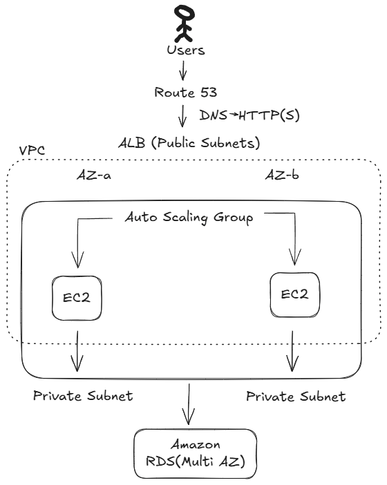
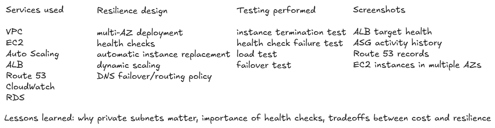

# resilient-multi-tier-AWS-architecture - AWS project nr 1
Design and deploy a web app that stays available during instance failure and scales automatically under load.

The application was deployed and tested using an AWS Application Load Balancer.

endpoint:
http://app-alb-880188632.eu-central-1.elb.amazonaws.com/

The infrastructure is provisioned using Terraform and may not be running continuously to minimize costs.